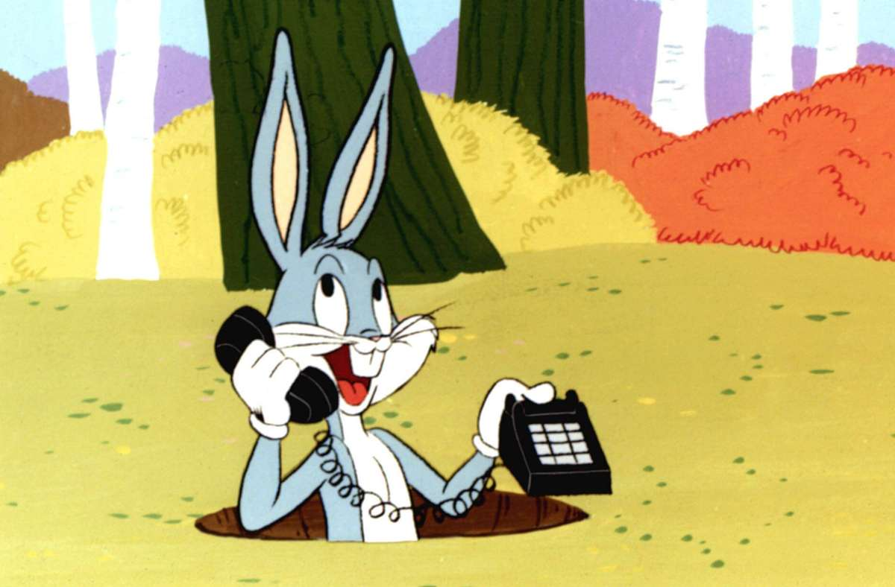
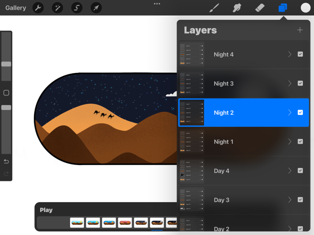
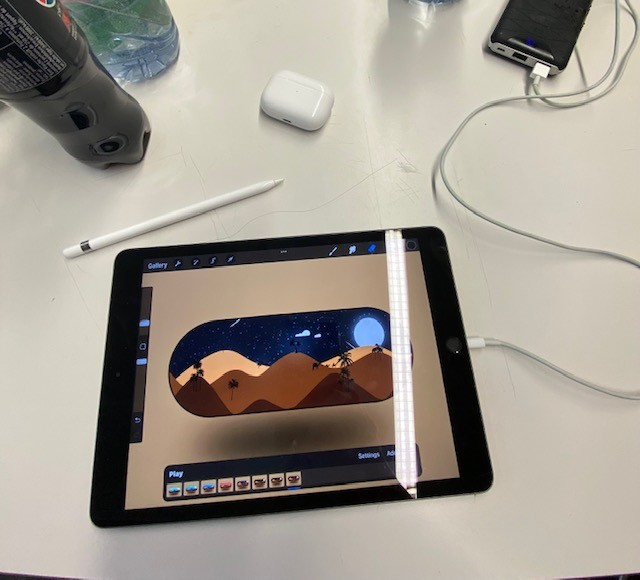
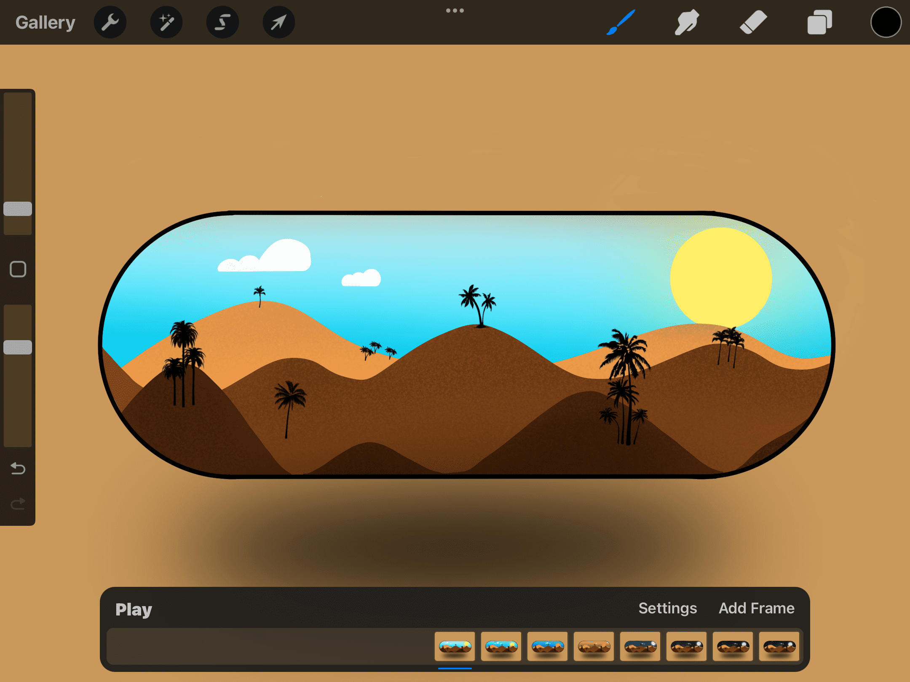

+++
title = "Animation mit Procreate"
date = "2022-05-10"
draft = false
pinned = false
tags = ["blog", "procreate", "animation"]
image = "bild-2.jpg"
description = "In diesem Blog erfahrt Ihr wie ich eine Animation in der Applikation Procreate erstellt habe."
footnotes = "*Quelle Bugs Bunny Bild*\n\n[Bugs Bunny wird achtzig: Unbesiegbar unbekümmert - Kultur - Stuttgarter Zeitung (stuttgarter-zeitung.de)](https://www.stuttgarter-zeitung.de/inhalt.bugs-bunny-wird-achtzig-unbesiegbar-unbekuemmert.0af0fe3d-ac65-4038-ba5d-171a8596d834.html?reduced=true)"
+++

# Projekt der Animation

### Animation

Animation ist das Aufnehmen kontinuierlicher Standbilder (Zeichnungen oder Fotografien von unbelebten Objekten) und deren Wiedergabe in schneller Folge, um eine realistische Bewegung nachzuahmen. Dies kann, wie bereits erwähnt, entweder als Zeichnung geschehen oder als Fotografie. Bei einer Zeichnung wird jede noch so kleine Bewegung gezeichnet, was sehr aufwändig in der Produktion ist. Gute Beispiele sind unsere Kindheitsstars, wie zum Beispiel Bugs Bunny, Mickey Mouse oder Asterix und Obelix.  Bei Fotografien ist das ganze wesentlich einfacher. Dabei wird zwar ebenfalls jede Bewegung erfasst, jedoch muss man nur auf den Auslöser drücken und schon ist das Bild gemacht.\
Bei beiden Varianten kann die Anzahl Bilder pro Sekunde, frames per second genannt, variieren.

## Selbständige Arbeit

Als wir den Auftrag erhielten dass wir eine freie gestalterische Arbeit machen können, war mir sofort klar was ich machen möchte. Da ich bereits während des Fernunterrichts viel auf dem iPad skizziert habe und auch einige Zeichnungen bereits erstellt habe, wollte ich auf jeden Fall etwas auf dem iPad machen. Ich benutze die Applikation Procreate, welche kostenpflichtig ist im App Store. Doch man kann nicht nur wunderschöne Zeichnungen erstellen auf der App, sondern auch seit neuesten Animationen kreieren. Dabei dachte ich mir, warum nicht ausprobieren?

Meine Materialien waren sehr simpel, ich brauchte nur mein iPad, einen Pencil und genügend Strom in der Nähe:)

###  Ideenfindung und Umsetzung

Ich wollte eine Animation erstellen die einfach ist und auch etwas Geschick benötigt. Es ist meine erste Animation, somit wollte ich die Messlatte realistisch setzen. Ich entschied mich für eine Szene in der Wüste, wobei einige Sandhügel im Vordergrund sind und es von Tag zu Nacht wechselt.\
Als allererstes habe ich den Hintergrund, also den Himmel, gezeichnet denn dort habe ich die meisten Veränderungen von Szene zu Szene. Das knifflige dabei war die Verläufe des Himmels so zu gestalten, dass es schöne Farbverläufe gibt. Das Praktische an Procreate ist, dass man auf mehreren Ebenen zeichnen kann, und so nicht immer das gezeichnete mitlöscht, wenn man über etwas malt.\
Danach strukturierte ich die Sandhügel, was ebenfalls Geschick forderte, da einige Sandhügel dunkler sein mussten, als andere. Zum Schluss fügte ich die Details hinzu, wie zum Beispiel die Karawanen auf den Hügeln oder die Palmen im Sand. Am Schluss merkte ich dann, dass es im Himmel ziemlich leer aussieht, nebst der Sonne und dem Mond. Aus diesem Grund fügte ich bei Tag noch einen Schwarm Vögel hinzu und bei Nacht Sterne und Sternschnuppen.

### Endprodukt

Das Endresultat kam meiner Meinung gut heraus. Ich hatte zwar am Anfang etwas Mühe mich in den Animationsbereich einzuarbeiten, aber nach 1 bis 2 Lektionen war das kein Problem mehr. Am Schluss konnte ich die frames per second noch individuell anpassen. Ich habe mich für 2 Bilder pro Sekunde entschieden, da das nicht zu schnell und nicht zu langsam ist. 

